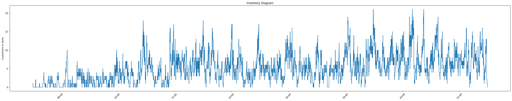
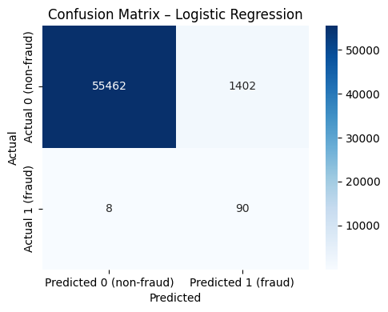

I am a **Master of Science in Business Analytics (MSBA)** candidate at **UC San Diego's Rady School of Management** (Class of 2026).

My passion lies in bridging the gap between complex data and actionable business strategy. I specialize in using machine learning and data visualization to solve operational problems.

### Technical Skills
`Python` `Polars/Pandas` `SQL` `Machine Learning` `Data Visualization` `A/B Testing`

 

# Projects

### Operations Analytics Project: Rogers Market

**Problem:** Investigated the operational efficiency of Rogers Market’s Amazon walk-out technology by analyzing average student trip duration and in-store customer levels.

  
   
  <em>Figure 1: Visualizing customer inventory accumulation over time.</em>

**Approach:**
- Constructed an inventory-over-time diagram (customers in store vs. time) and computed average in-store inventory by dividing the total area under the curve by total operating time.
- Validated the observed average inventory using Little’s Law by multiplying average throughput and average flow time.

**Outcome:** Demonstrated that the average in-store customer level (~5.2 customers) computed from observed data matched the value predicted by Little’s Law, validating the consistency of the system metrics.

[View the full analysis](content/ops_project/ops_code.html)

### Fraud Analytics Project: Investigating Fraud with Logistic Regression

**Problem:** Predicting the probability of fraudulent bank transactions in a heavily imbalanced data set (relatively low fraud) is difficult as accuracy becomes a bad measure of model accuracy.

  
  
   
  <em>Figure 2: Evaluation metrics showing the Confusion Matrix (Left) and ROC Curve (Right).</em>

**Approach:**
- Used logistic regression, as this was a classification problem, to assign probabilities of fraud to transactions.
- Evaluated model accuracy using a precision-recall curve, which is not biased by the large amount of regular transactions.

**Outcome:**
Showed that using a receiver operating characteristic (ROC) curve was not well suited for the fraud dataset, since the false positive rate (FPR) remained low even when many non-fraud transactions were incorrectly flagged, due to the large number of non-fraud cases. The Precision–Recall curve showed that as the decision threshold for the logistic regression was lowered, recall increased while precision decreased, revealing the true tradeoff despite the dataset’s imbalance.

[View the full analysis](content/fraud_project/fraud_code.html)
